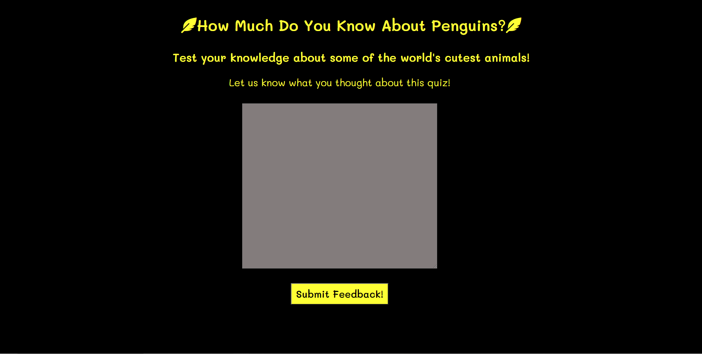

<h1>Penguin Quiz</h1>

The penguin quiz website is a fun page where penguin lovers can go to test their knowledge of penguin facts. The website offers entertainment to the user for a few minutes as they answer each question to the best of their knowledge.

The user of this website will be able to fill out a form with their information and create a username, select an answer and select when to submit it, recieve a notice on whether the response was right or wrong and what the correct answer was, see their current correct question score, see their final score, be able to offer feedback, and will recieve a thank you message once they have completed the feedback form.

<h2>Features</h2>

<ul>
    <li>
    <h3>Title and Username Form</h3>
    <ul>
    <li>Found in the middle of the page is the title of the quiz.</li>
    <li>Under the title of the quiz, the user will find a short heading explaining the quiz and the purpose of page.</li>
    <li>Then, under the smaller heading and in the middle of the page, the user will find a form that asks for their information and allows them to create their own username.</li>
    <li>Last on this page is the Let's Play! button that changes color on hover and allows the user to begin the quiz after they have completed the username form giving them control over when they want to initiate the quiz.</li>
    </ul>
    
    <li>
    <h3>Quiz Area</h3>
    <ul>
    <li>Once the Let's Play! button is clicked, the title and the smaller heading stay in place but the form disappears from the page allowing the quiz area to appear.</li>
    <li>The first question is already populated in the box along with the answers in radio button form so the user can only select one possible answer from the multiple choices available.</li>
    <li>Once the user selects an answer, they can find the Submit Answer button below to check if their answer is correct. This gives the user control of when they want to submit the answer in case they change their mind on what the correct answer is.</li>
    <li>After the answer has been submitted, an alert box will pop up informing the user if they got the answer correct or if they got it wrong and what the correct answer is.</li>
    <li>The user can then click on the Next Question button to move onto the next question in the quiz giving them time to look through the answers again before moving on, especially for those who might have gotten the question wrong. Both the Submit Question and Next Question buttons change color at hover to give the user more interactivity with the page.</li>
    <li>As the user gets the answers right or wrong, a score counter at the bottom keeps track of all the correct answers letting the user know how many right they have so far.</li>
    <li> At the end of the quiz, when the user clicks on the Next Question button one last time, another alert comes up on screen congratulating the user on completing the quiz and giving them their final score out of the number of available questions.</li>
    </ul>
    
    </li>
    <li>
    <h3>Feedback and Thank You for Playing Section</h3>
    <ul>
    <li>Once the alert informing the user of their finale score is cleared, the game area disappears and a feedback section appears asking the user to submit feedback for what they thought about the quiz.</li>
    <li>Once the user fills out the feedback textarea, they can submit the information with the Submit Feedback button that changes color on hover and recieve a final thank you for playing message on the screen. This terminates the quiz completely letting the user know that they are completely done with the quiz.</li>
    </ul>
    
    
    </li>
    </li>
</ul>
<h2>Future Features</h2>
<ul>
<li>It would be good for entertainment to add more questions to the quiz and have the questions populate in a randomized order.</li>
<li>Also, a place that could display the username of the user while they play would make the user feel more ownership over the page while they're playing.</li>
</ul>
<h2>Testing</h2>

<ul>
<li>I tested that this page works in differnt browsers: Chrome, Firefox, Microsoft Edge, Safari.</li>
<li>I confirmed that this page is responsive on different size standard screens as listed in the Am I Responsive website and by using DevTools.</li>
</ul>

<h3>Bugs</h3>
<h4>Validator Testing</h4>
<ul>
<li>HTML
    <ul>
    <li>Two errors and two warnings returned when passing through the offical W3C validator. The two errors where about the lack of values for the method and action attributes for the form element in the username form section. I added the form dump link from Code Institute and added a method of "post" and that resolved that problem. The two warnings recieved were for the lack of headers for the username form section and the feedback section. I left the warnings in place as the layout of the page does not need a header for either section in order for the user to understand what each section is.</li>
    </ul>
</li>
<li>CSS
<ul>
<li>No errors were found when passing through the official (Jigsaw) validator.</li>
</ul>

</li>
</ul>