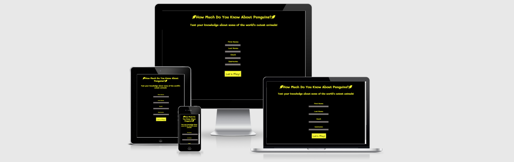
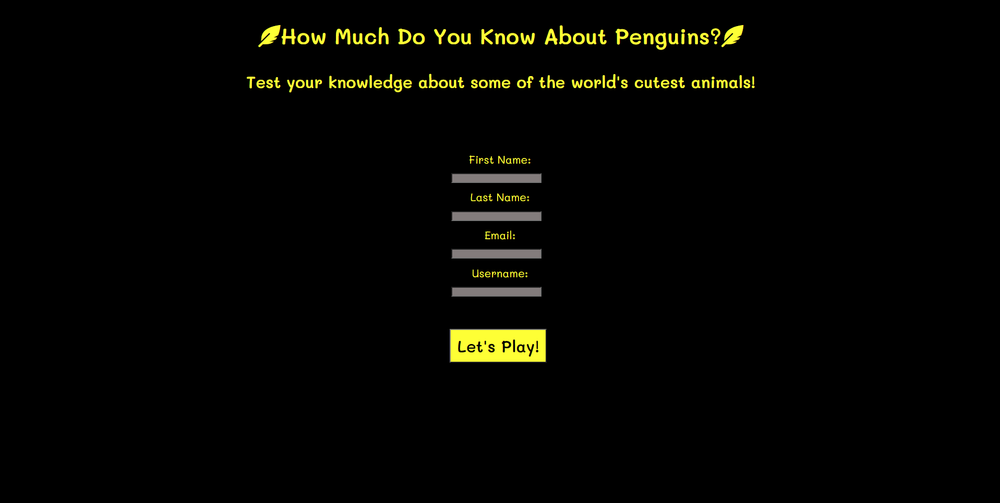
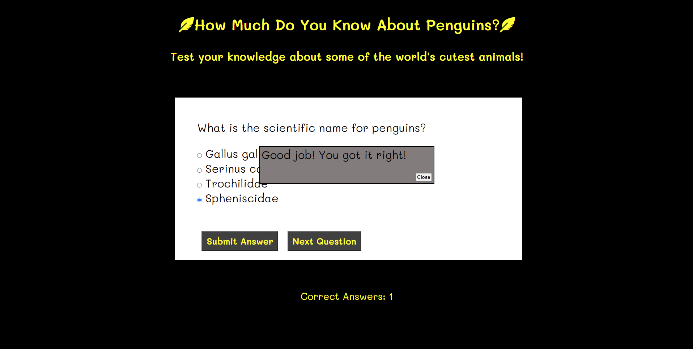
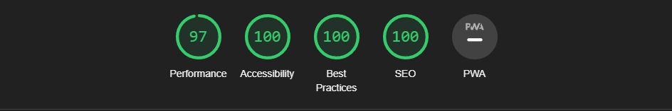

<h1>Penguin Quiz</h1>

The penguin quiz website is a fun page where penguin lovers can go to test their knowledge of penguin facts. The website offers entertainment to the user for a few minutes as they answer each question to the best of their knowledge.

The user of this website will be able to fill out a form with their information to create a username and take a multiple choice quiz where they can select an answer and submit when they're ready. The user will then receive a notice on whether the response was right or wrong and what the correct answer was. Their current correct question score is displayed at the bottom of the page to keep track of their progress and the user gets a notification at the end of the quiz with their final score. Lastly, the user is able to offer feedback, and will receive a thank you message once they have completed the feedback form.

<h2>Features</h2>

<ul>
    <li>
    <h3>Title and Username Form</h3>
    <ul>
    <li>Found in the middle of the page is the title of the quiz. Yellow text with a black background and gray input boxes were selected to go with the penguin theme.</li>
    <li>Under the title of the quiz, the user will find a short heading explaining the quiz and the purpose of page.</li>
    <li>Then, under the smaller heading and in the middle of the page, the user will find a form that asks for their information and allows them to create their own username.</li>
    <li>Last on this page is the Let's Play! button that changes color on hover and allows the user to begin the quiz after they have completed the username form giving them control over when they want to initiate the quiz.</li>
    </ul>
    
    <li>
    <h3>Quiz Area</h3>
    <ul>
    <li>Once the Let's Play! button is clicked, the title and the smaller heading stay in place but the form disappears from the page allowing the quiz area to appear. The quiz area is all white to resemble the belly of a penguin.</li>
    <li>The first question is already populated in the box along with the answers in radio button form so the user can only select one possible answer from the multiple choices available.</li>
    <li>Once the user selects an answer, they can find the Submit Answer button below to check if their answer is correct. This gives the user control of when they want to submit the answer in case they change their mind on what the correct answer is.</li>
    <li>After the answer has been submitted, a modal box will pop up informing the user if they got the answer correct or if they got it wrong and what the correct answer is.</li>
    <li>The user can then click on the Next Question button to move onto the next question in the quiz giving them time to look through the answers again before moving on, especially for those who might have gotten the question wrong. Both the Submit Question and Next Question buttons change color at hover to give the user more interactivity with the page.</li>
    <li>As the user gets the answers right or wrong, a score counter at the bottom keeps track of all the correct answers letting the user know how many right they have so far.</li>
    <li> At the end of the quiz, when the user clicks on the Next Question button one last time, the modal box comes up on screen congratulating the user on completing the quiz and giving them their final score out of the number of available questions.</li>
    </ul>
    
    </li>
    <li>
    <h3>Feedback and Thank You for Playing Section</h3>
    <ul>
    <li>Once the modal box informing the user of their finale score is cleared, the game area disappears and a feedback section appears asking the user to submit feedback for what they thought about the quiz.</li>
    <li>Once the user fills out the feedback textarea, they can submit the information with the Submit Feedback button that changes color on hover and receive a final thank you for playing message on the screen. This terminates the quiz completely and refreshes the page.</li>
    </ul>
    
    
    </li>
    </li>
</ul>
<h2>Future Features</h2>
<ul>
<li>It would be good for entertainment to add more questions to the quiz and have the questions populate in a randomized order.</li>
<li>Also, a place that could display the username of the user while they play would make the user feel more ownership over the page while they're playing.</li>
</ul>
<h2>Testing</h2>

<ul>
<li>I tested that this page works in differnt browsers: Chrome, Firefox, Microsoft Edge, Safari.</li>
<li>I confirmed that this page is responsive on different size standard screens as listed in the Am I Responsive website and by using DevTools.</li>
</ul>

<h3>Bugs</h3>
<h4>Validator Testing</h4>
<ul>
<li>HTML
    <ul>
    <li>Two errors and two warnings returned when passing through the offical W3C validator. The two errors where about the lack of values for the method and action attributes for the form element in the username form section. I added the form dump link from Code Institute and added a method of "post" and that resolved that problem. The two warnings received were for the lack of headers for the username form section and the feedback section. I fixed the warnings by adding headers to both sections.</li>
    <li>No further errors or warnings were found when passing through the W3C Validator a second time.</li>
    </ul>
</li>
<li>CSS
<ul>
    <li>No errors were found when passing through the official (Jigsaw) validator.</li>
</ul>
</li>
<li>JavaScript
<ul>
    <li>Twenty-five warnings were returned after passing through the JSHint validator. The warnings were recommending using 'esversion6' as 'let' statements, 'for of' statements, and 'template literal syntax' are only available on ES6.</li>
</ul>
</li>
<li>Accessibility
<ul>
    <li>I confirmed that the colors and fonts chosen are easy to read and accessible by running it through Lighthouse in DevTools.</li>
    
</ul>
</li>
</ul>

<h2>Deployment</h2>

<ul>
<li>The site was deployed using GitHub pages. The steps were as follows:
    <li>In the GitHub <a href= "https://github.com/LinaGarcia24/penguin-quiz">repository</a> navigate to the settings tab.</li>
    <li>On the menu on the left hand side, under "Code and automation" click on the last tab that reads "Pages".</li>
    <li>Once in pages, in the dropdown menu in the "Source" section select the "main" branch and click save.</li>
    <li>Once the main branch has been selected and saved, the link to the deployed website is provided.</li>
</li>
</ul>

The live site can be found here: <a href="https://linagarcia24.github.io/penguin-quiz/">Penguin Quiz</a>

<h2>Credits</h2>

<h3>Content</h3>
<ul>
    <li>Guiding code for DOMContentLoaded eventlistener and score counter was derived from the <a href="https://github.com/LinaGarcia24/love-maths">Love Maths</a> project.</li>
    <li>Code for storing selected answer from radio buttons was derived from <a href="https://www.javascripttutorial.net/javascript-dom/javascript-radio-button/">javascripttutorial.net</a>.</li>
    <li>Code for how to structure questions and answers array was derived from <a href="https://www.sitepoint.com/simple-javascript-quiz/">sitepoint.com</a>.</li>
    <li>Information on forEach loop and how to use it as well as how to use the classList add and remove came from this YouTube tutorial by <a href= "https://www.youtube.com/watch?v=riDzcEQbX6k&t=1177s">Web Dev Simplified</a>.</li>
    <li>Information on how to create a modal box came from <a href= "https://www.w3schools.com/howto/howto_css_modals.asp">w3schools.com</a>.</li>
</ul>

<h3>Media</h3>
<ul>
    <li>Favicon came from <a href="https://favicon.io/emoji-favicons/penguin/">favicon.io</a>.</li>
</ul>

<h3>Acknowledgements</h3>
<ul>
    <li>Thank you to my mentor, Victor Miclovich for suggesting the use of a modal box and teaching me better ways to organize arrays that I can use in future projects.</li>
</ul>